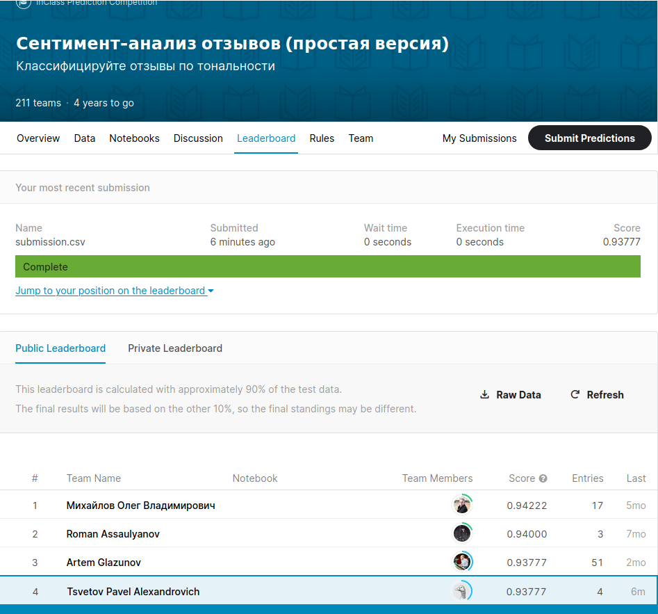

# Coursera Kaggle Task - Sentiment Analysis
Kaggle InClass Competition [Сентимент-анализ отзывов](https://www.kaggle.com/c/simplesentiment/overview)

Sentiment analysis task using PyTorch and pre-trained ROBERTA model, with Drophead regularization.

Achieved 93% accuracy on test, 4th(top 2%) place on the leaderboard.
